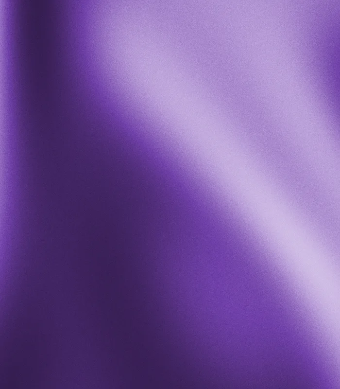

# @dooph-software/mesh-gradients

Deterministic, seeded mesh-gradient images plus a curated set of <!-- docs:begin:palette-count -->71<!-- docs:end:palette-count --> color palettes. The same seed, palette, size and look always render the same image.

```bash
npm install @dooph-software/mesh-gradients
```

generate on demand

```bash
npm run gradient -- --palette jewel-peacock --seed gradient --width 700 --height 500
```

### Agent skills

To help your coding agent use this package correctly (what to store per image, server vs. client imports, how size affects the composition), copy the bundled skills into your project:

```bash
npx mesh-gradients-init-skills
```

It asks which agent directories to install to (`.agents/`, `.claude/`, `.agent/`) and changes nothing else.

## Featured Examples

<!-- docs:begin:featured -->
<table>
  <tr>
    <td align="center"><br><code>purple-rain</code> · seed <code>kanye</code><br><sub>dreamscape</sub></td>
    <td align="center"><br><code>onyx-gold</code> · seed <code>the-weeknd</code><br><sub>gravity</sub></td>
    <td align="center"><br><code>cobalt-ice</code> · seed <code>aspect</code><br><sub>cirrus</sub></td>
    <td align="center"><br><code>burgundy-velvet</code> · seed <code>burgundy-velvet</code><br><sub>silk</sub></td>
  </tr>
</table>
<!-- docs:end:featured -->

## Palettes

See every palette in the [examples gallery](./examples/README.md). Regenerate it with `npm run examples`.

Import from `/palettes` when you only need colors, for example in a browser or edge bundle. That entry has no dependencies.

```ts
import {
  colorPalettes,
  findPalette,
  pickPalette,
  paletteAccent,
  paletteComplement,
  complementColor,
} from "@dooph-software/mesh-gradients/palettes";

findPalette("mint-sea"); // { name: 'mint-sea', colors: [...] }. Throws on unknown names
pickPalette("autocad-0.3.0"); // deterministic pick from any seed string
paletteAccent(findPalette("jewel-peacock")); // '#1f7a99'. The ramp's mid-tone, for UI accents
paletteComplement(findPalette("jewel-peacock")); // '#fc6d00'. Opposite hue, vivid, for chips
complementColor("#2f4fd8"); // '#eab500'. Same, for any hex
```

`PaletteName` is a union of the built-in names, so you get autocomplete in editors.

The **complement** is built to stand out on the palette's images, for chips and geometry. Its hue is exactly opposite the accent's (180° in OKLCH, a perceptual color space); if the accent is near-gray, the hue is taken from the whole ramp's tint instead. It uses the most saturated color that hue can have within a readable lightness range, so muted palettes still get a vivid complement: `battleship-steel`'s is pink. Palettes with no hue at all (`onyx-snow`) get a gray at the opposite lightness. Render results include both `accent` and `complement`.

A palette has a unique `name` and **3–5** `#rrggbb` colors, ordered light to dark. The `Palette` type enforces the count and the `#`, so an inline palette with 2 or 6 colors fails typechecking. The factory (see "Custom palettes" below) and the render functions also call `validatePalette` at runtime, which catches palettes built from JSON, casts or CLI input.

`pickPalette` uses rendezvous hashing. Each palette gets a score from `seed + name`, and the highest score wins. As a result:

- List order doesn't affect the result.
- Adding a palette only moves the seeds it wins, about 1 in N.
- Removing a palette only moves the seeds that had picked it.
- Renaming a palette counts as removing it and adding a new one.

## Custom palettes

To use your own palettes, create a generator bound to your set. Put it in a module in your project and export it:

```ts
// lib/gradients.ts
import {
  colorPalettes,
  createMeshGradients,
} from "@dooph-software/mesh-gradients";

export const gradients = createMeshGradients({
  palettes: [
    ...colorPalettes,
    { name: "brand", colors: ["#f4f4f5", "#8fa579", "#1f2c44"] },
  ],
  width: 1920, // optional default output size for this generator (1200 × 1500 if omitted)
  height: 1080,
});

// elsewhere
await gradients.generate({ seed: "hero", palette: "brand" }); // 1920 × 1080, names typed from your set
await gradients.generate({ seed: "og", width: 1200, height: 630 }); // per-call size wins
gradients.pickPalette("hero"); // picks only from your set
```

`createMeshGradients` validates the whole set as soon as it's called: color counts, hex format, unique names and the default size. A bad palette fails when the module loads, not on the first render. The top-level `generateMeshGradient` and `renderMeshGradient` functions are this same generator with the built-in palettes.

For a one-off, you can also pass a palette object directly: `generateMeshGradient({ seed, palette: { name: 'x', colors: [...] } })`.

## Rendering images (Node)

Rendering runs in Node and uses `@napi-rs/canvas` (compositing, PNG) and `sharp` (WebP), which install automatically as prebuilt native binaries.

```ts
import { writeFileSync } from "node:fs";
import { generateMeshGradient } from "@dooph-software/mesh-gradients";

const { buffer, palette, accent } = await generateMeshGradient({
  seed: "autocad-0.3.0",
  palette: "jewel-peacock", // optional. Omit to pick from the seed
  width: 1200, // default 1200
  height: 1500, // default 1500
  format: "webp", // 'webp' (default, quality 82) | 'png'
});
writeFileSync("gradient.webp", buffer);
```

Use `renderMeshGradient(options)` to get the raw `@napi-rs/canvas` canvas if you want to draw on top of it before encoding.

`look` overrides the rendering knobs. The defaults are exported as `defaultLook`:

<!-- docs:begin:look-knobs -->
| Knob | Default | Effect |
| --- | --- | --- |
| `baseNoiseFrequency` | `0.3` | Lower values give broader, softer color regions. |
| `domainWarpStrength` | `1` | How much the color field swirls. |
| `fractalOctaveCount` | `2` | More octaves add finer detail. |
| `colorTransitionContrast` | `1.75` | Sharpness of the edges between colors. |
| `grainOpacity` | `0.09` | Strength of the film-grain overlay. |
<!-- docs:end:look-knobs -->

## CLI

Every flag is optional. With none, it writes one WebP to `output/` with a random seed and the palette that seed picks. Both are printed with the result, so passing them back reproduces the image exactly.

```bash
npm run gradient                       # in this repo (builds first, then runs the CLI)
npx mesh-gradient                      # anywhere the package is installed
npm run gradient -- --seed hero --palette purple-rain --width 1920 --height 1080
npx mesh-gradient --seed autocad-0.3.0 --out assets/0.3.0.webp
npx mesh-gradient --list-palettes
```

<!-- docs:begin:cli-help -->
```text
Usage: mesh-gradient [options]

Every flag is optional. With none, writes one WebP with a random seed and a
palette picked from that seed.

Options:
  --seed <string>                  Seed string. Same seed → same image. Default: random.
  --palette <name>                 Built-in palette name. Default: a deterministic pick from the seed.
  --width <px>                     Output width. Default 1200.
  --height <px>                    Output height. Default 1500.
  --quality <1-100>                WebP quality. Default 82.
  --base-noise-frequency <n>       Lower values give broader, softer color regions. Default 0.3.
  --domain-warp-strength <n>       How much the color field swirls. Default 1.
  --fractal-octave-count <n>       More octaves add finer detail. Default 2.
  --color-transition-contrast <n>  Sharpness of the edges between colors. Default 1.75.
  --grain-opacity <0-1>            Strength of the film-grain overlay. Default 0.09.

Output & info:
  --out <path>                     Output file, .webp or .png. Default: output/<palette>-<seed>.webp
  --json                           Print result metadata as JSON.
  --list-palettes                  Print built-in palette names and exit.
  --help                           Show this help (-h).
```
<!-- docs:end:cli-help -->

Flags are defined once in [src/flags.ts](src/flags.ts) and the CLI builds its parser, help text and options from that table. The table is typed as "one entry per render option", so adding an option to the API fails the typecheck until it has a flag — the CLI and the TS API can't drift. `--out`, `--json`, `--list-palettes` and `--help` are CLI-only, since they're file output and terminal display.

## Development

```bash
npm install
npm test        # builds, then runs node:test
npm run lint    # tsc --noEmit
```

Docs that describe the code are generated from it:

- `npm run docs` fills the marked sections of this README (palette count, the look-knob table, the CLI help) from the built package. Prose outside the markers is never touched.
- `npm test` runs `sync-docs --check`, which fails if those sections are stale, and typechecks every ```ts block in this README against `src/`, so a sample that no longer matches the API fails the build.

One test renders seed `aspect` with `jewel-peacock` and checks the result byte-for-byte against `test/fixtures/jewel-peacock-aspect.webp`, which is Aspect's shipped 0.3.0 artwork. If that test fails after you upgrade `sharp`, check whether the pixels differ or only the encoded bytes do.

Releases work like the design system: run `npm run prep-release:<patch|minor|major>`, then publish a GitHub release. That triggers `.github/workflows/release-package.yml`.
