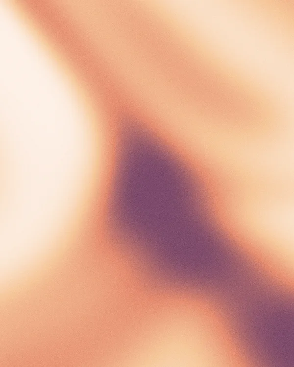
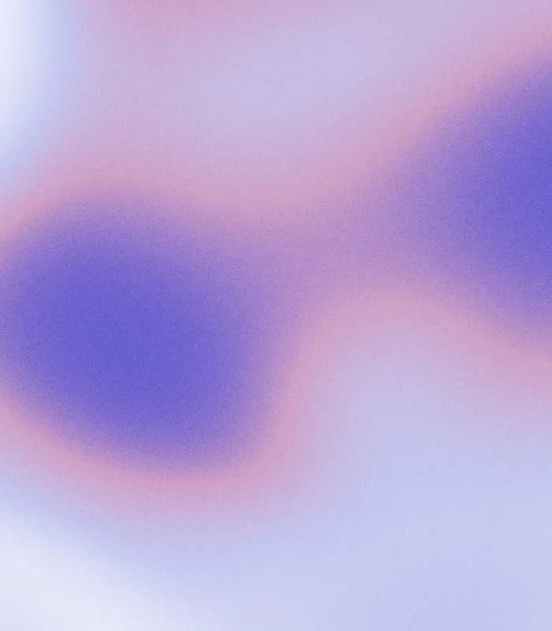
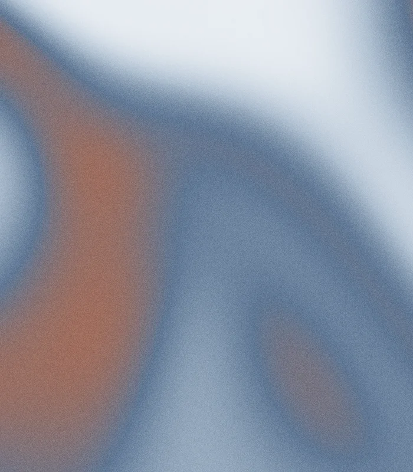
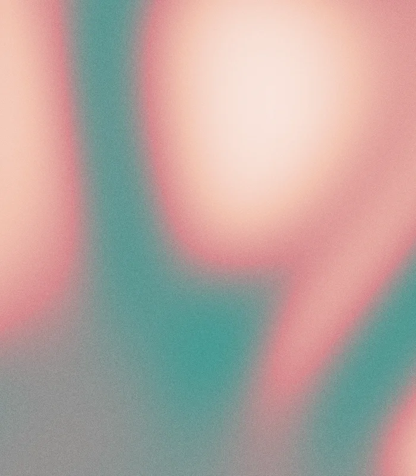
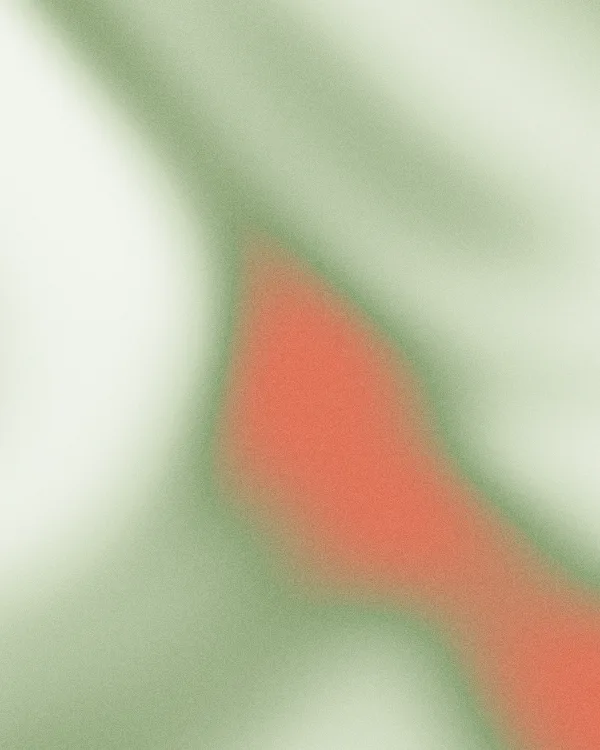
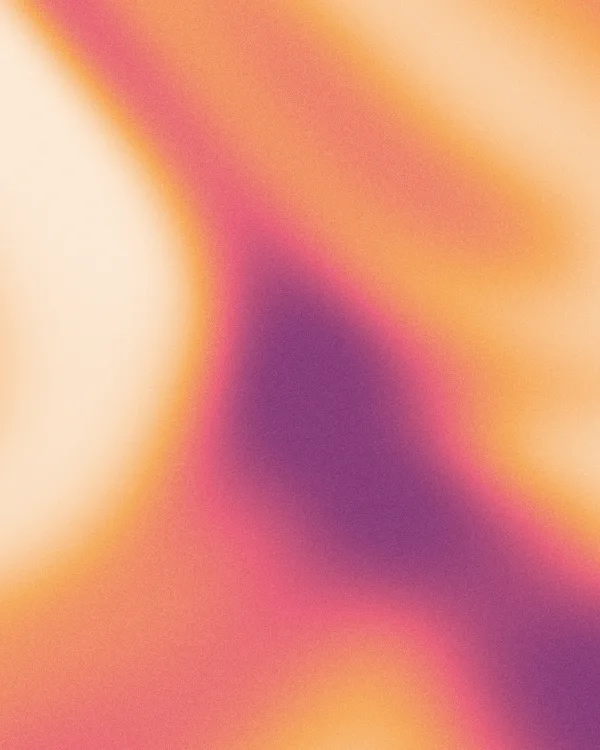
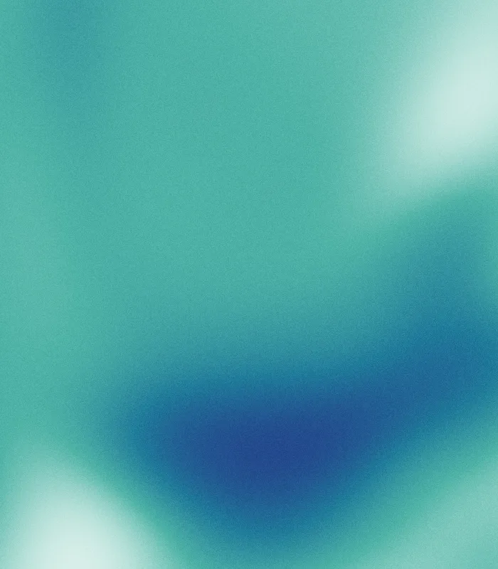

<!-- AUTO-GENERATED by scripts/generate-examples.mjs. Run `npm run examples` to refresh. -->
# Palette examples

One sample per built-in palette, seed `example`, 600×750 WebP.

<table>
  <tr>
    <td align="center"> <code>amber-latte</code> #faf4ea #f2d29b #e0a45c #b9722f accent #e0a45c</td>
    <td align="center"> <code>terracotta-sand</code> #f6ede1 #e8c9a0 #cf8f63 #9c4e33 accent #cf8f63</td>
    <td align="center"> <code>peach-blush</code> #fdf1ec #f8cbb6 #ef9a8a #d76e73 accent #ef9a8a</td>
    <td align="center"> <code>coral-cream</code> #fbe9df #f5b79a #e8735a #c33f36 accent #e8735a</td>
  </tr>
  <tr>
    <td align="center"> <code>honey-espresso</code> #f7ecd9 #e5b877 #b9793f #5f3418 accent #b9793f</td>
    <td align="center"> <code>apricot-plum</code> #fdf0e6 #f6c79a #e58b6f #7d4a6b accent #e58b6f</td>
    <td align="center"> <code>lavender-rose</code> #f4eefb #d9c2ef #c98fb8 #8a5fd0 accent #c98fb8</td>
    <td align="center"> <code>violet-mist</code> #f1eefb #c9b8ef #8f7fe0 #4a3d9c accent #8f7fe0</td>
  </tr>
  <tr>
    <td align="center"> <code>mauve-plum</code> #f6f0f2 #d8b8c6 #a5738c #5f3a55 accent #a5738c</td>
    <td align="center"> <code>periwinkle-blush</code> #f0f0fb #c3c6f0 #cf9fc6 #6a5fd0 accent #cf9fc6</td>
    <td align="center"> <code>orchid-frost</code> #f6eff6 #e0c2e0 #b98fc4 #7a5aa6 #3f2f5c accent #b98fc4</td>
    <td align="center"> <code>sky-slate</code> #eef4fb #bcd2ef #6f8fc4 #2f3f66 accent #6f8fc4</td>
  </tr>
  <tr>
    <td align="center"> <code>teal-fog</code> #eef7f6 #b6dcd8 #5fa39c #234a49 accent #5fa39c</td>
    <td align="center"> <code>arctic-ink</code> #f2f6f8 #cddbe2 #7f96a3 #1c2630 accent #7f96a3</td>
    <td align="center"> <code>cloud-navy</code> #f0f3f7 #c6d1de #7488a3 #1f2c44 accent #7488a3</td>
    <td align="center"> <code>denim-clay</code> #eef2f6 #aebfd0 #5f7794 #b06a4e accent #5f7794</td>
  </tr>
  <tr>
    <td align="center"> <code>sage-mist</code> #f2f5ee #cdd8bd #8fa579 #4a5c3a accent #8fa579</td>
    <td align="center"> <code>mint-sea</code> #eef8f4 #b6e2d2 #5fb39c #1f5c4d accent #5fb39c</td>
    <td align="center"> <code>olive-cream</code> #f6f3e6 #dbd09b #a39a5c #5f5a2f accent #a39a5c</td>
    <td align="center"> <code>eucalyptus-fog</code> #eff4f1 #cbdcd2 #94b3a6 #4f6b60 accent #94b3a6</td>
  </tr>
  <tr>
    <td align="center"> <code>periwinkle-gold</code> #dfe6ff #a9b6f0 #5b6bd6 #e6c25a accent #5b6bd6</td>
    <td align="center"> <code>lilac-lemon</code> #f3eefb #d3c2ef #9f8fd0 #e6d25a accent #9f8fd0</td>
    <td align="center"> <code>blush-teal</code> #fbeee9 #f2c2b0 #d78a8f #3f9c94 accent #d78a8f</td>
    <td align="center"> <code>sage-coral</code> #f2f5ee #cdd8bd #8fa579 #e0755a accent #8fa579</td>
  </tr>
  <tr>
    <td align="center"> <code>slate-amber</code> #eef2f6 #bcc9d8 #5f7794 #e0a24e accent #5f7794</td>
    <td align="center"> <code>sunset-rose</code> #fce9d6 #f6a95c #e8617a #8a3d7a accent #e8617a</td>
    <td align="center"> <code>berry-bloom</code> #fbe9f2 #e88fb8 #c94f8f #7a2f6a accent #c94f8f</td>
    <td align="center"> <code>jewel-peacock</code> #e6f5f0 #4fb3a6 #1f7a99 #243f8a accent #1f7a99</td>
  </tr>
  <tr>
    <td align="center"> <code>iris-meadow</code> #eaf5ec #7cc48f #3f8fb3 #5f4fb0 accent #3f8fb3</td>
    <td align="center"> <code>autumn-spice</code> #f7ecd6 #dba24f #b5522f #6e2f4a accent #b5522f</td>
    <td align="center"> <code>ultraviolet-sea</code> #e9f0fb #6f9fe0 #4a5fc4 #6a3da6 accent #4a5fc4</td>
    <td align="center"> <code>fog-plum</code> #f2f0f3 #cfc6d2 #9a8a9c #5f4a5c accent #9a8a9c</td>
  </tr>
  <tr>
    <td align="center"> <code>sand-sky</code> #f4efe4 #e0d3b8 #a9bcc4 #5f7f8c accent #a9bcc4</td>
    <td align="center"> <code>ivory-ink</code> #f7f4ef #d8d2c8 #8a8378 #20201d accent #8a8378</td>
    <td align="center"> <code>paper-graphite</code> #f4f4f5 #cfcfd4 #83838f #1c1c22 accent #83838f</td>
    <td align="center"> <code>bone-coffee</code> #f5efe6 #d9c9b3 #9c8468 #3a2c1e accent #9c8468</td>
  </tr>
  <tr>
    <td align="center"> <code>porcelain-greige</code> #f6f3ef #ddd4c9 #b0a596 #6a5f52 accent #b0a596</td>
  </tr>
</table>
