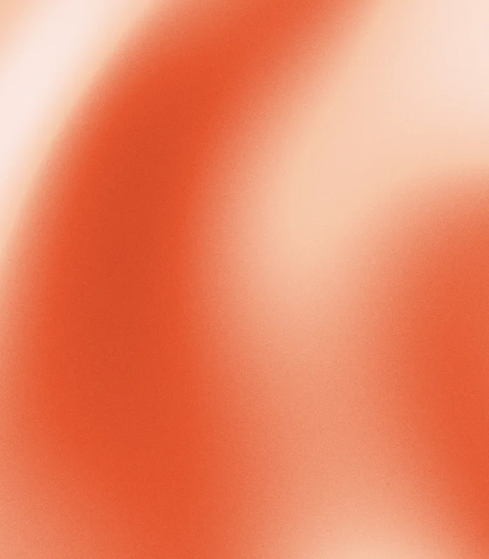
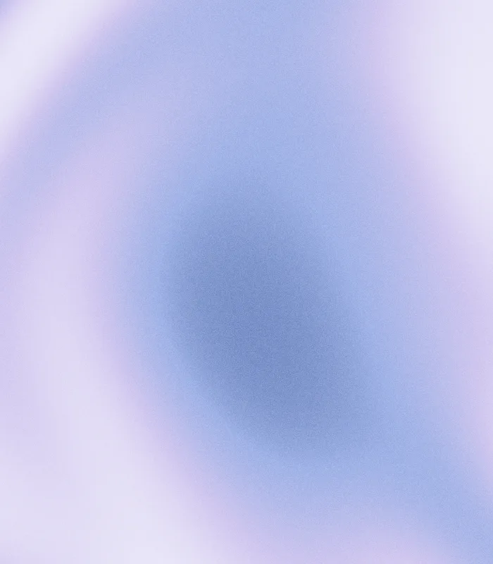
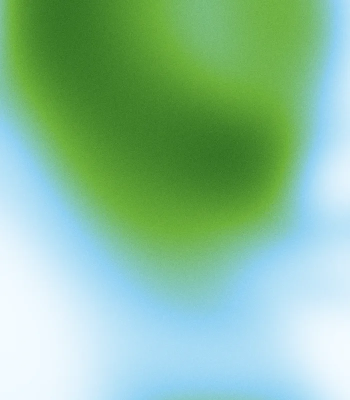
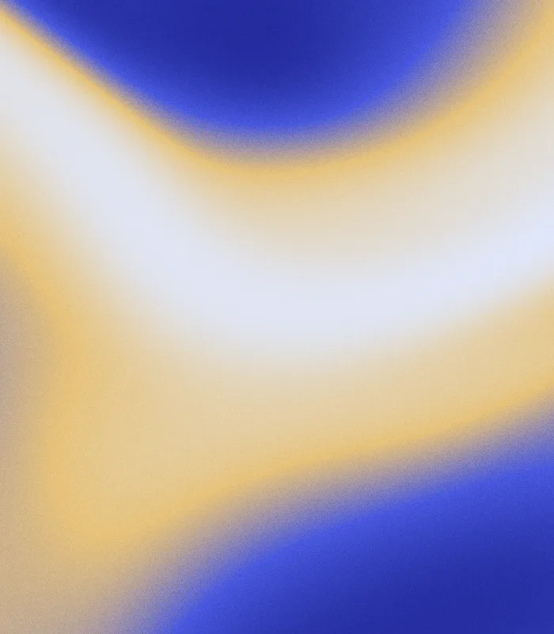
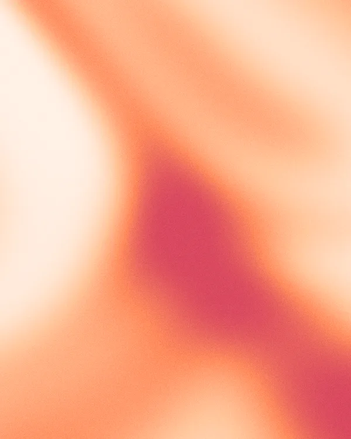
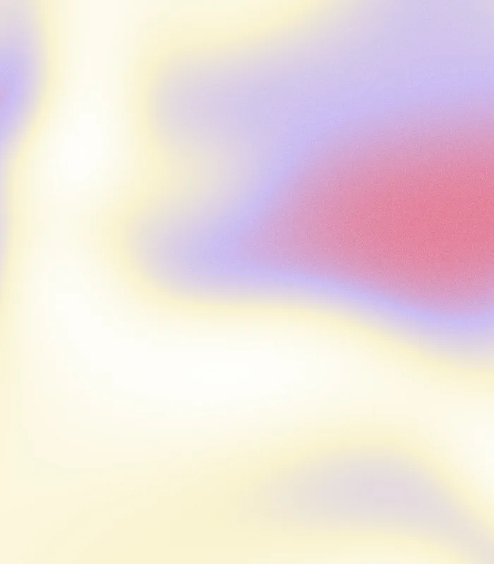
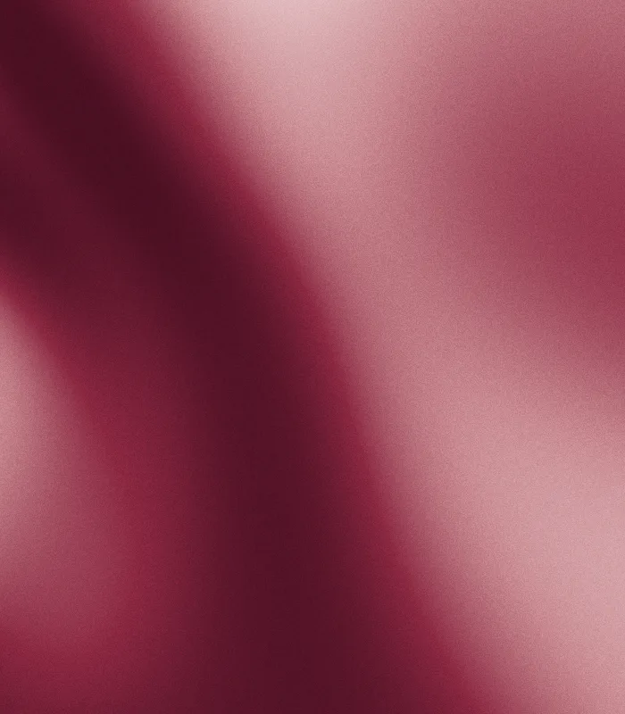

<!-- AUTO-GENERATED by scripts/generate-examples.mjs. Run `npm run examples` to refresh. -->
# Palette examples

One sample per built-in palette, 600×750 WebP. Each one uses its own palette name as the seed, so the compositions vary; the seed is listed under each sample.

<table>
  <tr>
    <td align="center"> <code>amber-latte</code> #faf4ea #f2d29b #e0a45c #b9722f accent #e0a45c · complement #0095fd seed <code>amber-latte</code></td>
    <td align="center"> <code>terracotta-sand</code> #f6ede1 #e8c9a0 #cf8f63 #9c4e33 accent #cf8f63 · complement #00b8ff seed <code>terracotta-sand</code></td>
    <td align="center"> <code>peach-blush</code> #fdf1ec #f8cbb6 #ef9a8a #d76e73 accent #ef9a8a · complement #00d5f0 seed <code>peach-blush</code></td>
    <td align="center"> <code>coral-cream</code> #fbe9df #f5b79a #e8735a #c33f36 accent #e8735a · complement #00d4f4 seed <code>coral-cream</code></td>
  </tr>
  <tr>
    <td align="center"> <code>honey-espresso</code> #f7ecd9 #e5b877 #b9793f #5f3418 accent #b9793f · complement #00acfe seed <code>honey-espresso</code></td>
    <td align="center"> <code>apricot-plum</code> #fdf0e6 #f6c79a #e58b6f #7d4a6b accent #e58b6f · complement #00d3fb seed <code>apricot-plum</code></td>
    <td align="center"> <code>golden-hour</code> #fdf3e1 #f7cf8a #e89a5a #9a4a3a accent #e89a5a · complement #00b0fd seed <code>golden-hour</code></td>
    <td align="center"> <code>vermilion-blush</code> #fbe8e2 #f7c6a8 #e4562f #a82a1c accent #e4562f · complement #00d4f8 seed <code>vermilion-blush</code></td>
  </tr>
  <tr>
    <td align="center"> <code>ivory-gilt</code> #fffdf7 #f7ecd0 #e0c47e #b08c3a accent #e0c47e · complement #3652d3 seed <code>ivory-gilt</code></td>
    <td align="center"> <code>rose-gold</code> #fceee8 #f2cdbd #dba18c #b3705c accent #dba18c · complement #06d2ff seed <code>rose-gold</code></td>
    <td align="center"> <code>peony-glow</code> #fdeef3 #f9b3c8 #f78a5c #f2a93f accent #f78a5c · complement #00ceff seed <code>peony-glow</code></td>
    <td align="center"> <code>lavender-rose</code> #f4eefb #d9c2ef #c98fb8 #8a5fd0 accent #c98fb8 · complement #00e18d seed <code>lavender-rose</code></td>
  </tr>
  <tr>
    <td align="center"> <code>violet-mist</code> #f1eefb #c9b8ef #8f7fe0 #4a3d9c accent #8f7fe0 · complement #c7c600 seed <code>violet-mist</code></td>
    <td align="center"> <code>mauve-plum</code> #f6f0f2 #d8b8c6 #a5738c #5f3a55 accent #a5738c · complement #00deaa seed <code>mauve-plum</code></td>
    <td align="center"> <code>periwinkle-blush</code> #f0f0fb #c3c6f0 #cf9fc6 #6a5fd0 accent #cf9fc6 · complement #20e17c seed <code>periwinkle-blush</code></td>
    <td align="center"> <code>orchid-frost</code> #f6eff6 #e0c2e0 #b98fc4 #7a5aa6 #3f2f5c accent #b98fc4 · complement #72db52 seed <code>orchid-frost</code></td>
  </tr>
  <tr>
    <td align="center"> <code>quartz-rose</code> #faf1f1 #ecc9cc #c99aa3 #8a5f6a accent #c99aa3 · complement #00dacb seed <code>quartz-rose</code></td>
    <td align="center"> <code>wisteria-sky</code> #f2f0fb #cfc6ef #9fb2e6 #4f6aa6 accent #9fb2e6 · complement #e8b700 seed <code>wisteria-sky</code></td>
    <td align="center"> <code>zephyr-dawn</code> #fdf3f5 #f2d6e2 #c6d6f2 #7f9fd8 accent #c6d6f2 · complement #f2b100 seed <code>zephyr-dawn</code></td>
    <td align="center"> <code>candy-sky</code> #f6e8ff #f7a3e8 #9aa8f5 #3fa0f5 accent #9aa8f5 · complement #debb00 seed <code>candy-sky</code></td>
  </tr>
  <tr>
    <td align="center"> <code>sky-slate</code> #eef4fb #bcd2ef #6f8fc4 #2f3f66 accent #6f8fc4 · complement #f4b000 seed <code>sky-slate</code></td>
    <td align="center"> <code>teal-fog</code> #eef7f6 #b6dcd8 #5fa39c #234a49 accent #5fa39c · complement #e94777 seed <code>teal-fog</code></td>
    <td align="center"> <code>arctic-ink</code> #f2f6f8 #cddbe2 #7f96a3 #1c2630 accent #7f96a3 · complement #ff7f00 seed <code>arctic-ink</code></td>
    <td align="center"> <code>cloud-navy</code> #f0f3f7 #c6d1de #7488a3 #1f2c44 accent #7488a3 · complement #faac00 seed <code>cloud-navy</code></td>
  </tr>
  <tr>
    <td align="center"> <code>denim-clay</code> #eef2f6 #aebfd0 #5f7794 #b06a4e accent #5f7794 · complement #feaa00 seed <code>denim-clay</code></td>
    <td align="center"> <code>cobalt-ice</code> #e8eeff #b9cdfb #2f4fd8 #1836b8 accent #2f4fd8 · complement #eab500 seed <code>cobalt-ice</code></td>
    <td align="center"> <code>sage-mist</code> #f2f5ee #cdd8bd #8fa579 #4a5c3a accent #8fa579 · complement #a151d4 seed <code>sage-mist</code></td>
    <td align="center"> <code>mint-sea</code> #eef8f4 #b6e2d2 #5fb39c #1f5c4d accent #5fb39c · complement #e54d98 seed <code>mint-sea</code></td>
  </tr>
  <tr>
    <td align="center"> <code>olive-cream</code> #f6f3e6 #dbd09b #a39a5c #5f5a2f accent #a39a5c · complement #5648d0 seed <code>olive-cream</code></td>
    <td align="center"> <code>eucalyptus-fog</code> #eff4f1 #cbdcd2 #94b3a6 #4f6b60 accent #94b3a6 · complement #e452a8 seed <code>eucalyptus-fog</code></td>
    <td align="center"> <code>kelp-forest</code> #eef3ea #a9c49a #4f7a5a #1f3a2f accent #4f7a5a · complement #df64d2 seed <code>kelp-forest</code></td>
    <td align="center"> <code>yuzu-mint</code> #fbfbe6 #eef29a #b3d98a #3f8f7a accent #b3d98a · complement #a051d4 seed <code>yuzu-mint</code></td>
  </tr>
  <tr>
    <td align="center"> <code>lime-lagoon</code> #f8ffe8 #c8f56a #6fe3d8 #2fc6d8 accent #6fe3d8 · complement #e94777 seed <code>lime-lagoon</code></td>
    <td align="center"> <code>bliss-meadow</code> #f4fbff #8ed0f2 #6cb03a #2d6b22 accent #6cb03a · complement #b157d7 seed <code>bliss-meadow</code></td>
    <td align="center"> <code>periwinkle-gold</code> #dfe6ff #a9b6f0 #5b6bd6 #e6c25a accent #5b6bd6 · complement #e1ba00 seed <code>periwinkle-gold</code></td>
    <td align="center"> <code>lilac-lemon</code> #f3eefb #d3c2ef #9f8fd0 #e6d25a accent #9f8fd0 · complement #bbca00 seed <code>lilac-lemon</code></td>
  </tr>
  <tr>
    <td align="center"> <code>blush-teal</code> #fbeee9 #f2c2b0 #d78a8f #3f9c94 accent #d78a8f · complement #00d8d9 seed <code>blush-teal</code></td>
    <td align="center"> <code>sage-coral</code> #f2f5ee #cdd8bd #8fa579 #e0755a accent #8fa579 · complement #a151d4 seed <code>sage-coral</code></td>
    <td align="center"> <code>slate-amber</code> #eef2f6 #bcc9d8 #5f7794 #e0a24e accent #5f7794 · complement #feaa00 seed <code>slate-amber</code></td>
    <td align="center"> <code>ultramarine-sand</code> #dfe8ff #e6c27a #4757dd #232a9c accent #4757dd · complement #e3b900 seed <code>ultramarine-sand</code></td>
  </tr>
  <tr>
    <td align="center"> <code>amber-tide</code> #eef4f8 #a9c8ef #f2b96b #df8a33 accent #f2b96b · complement #0088fc seed <code>amber-tide</code></td>
    <td align="center"> <code>sunset-rose</code> #fce9d6 #f6a95c #e8617a #8a3d7a accent #e8617a · complement #00d9d4 seed <code>sunset-rose</code></td>
    <td align="center"> <code>berry-bloom</code> #fbe9f2 #e88fb8 #c94f8f #7a2f6a accent #c94f8f · complement #00ddb0 seed <code>berry-bloom</code></td>
    <td align="center"> <code>jewel-peacock</code> #e6f5f0 #4fb3a6 #1f7a99 #243f8a accent #1f7a99 · complement #fc6d00 seed <code>jewel-peacock</code></td>
  </tr>
  <tr>
    <td align="center"> <code>iris-meadow</code> #eaf5ec #7cc48f #3f8fb3 #5f4fb0 accent #3f8fb3 · complement #fe7900 seed <code>iris-meadow</code></td>
    <td align="center"> <code>autumn-spice</code> #f7ecd6 #dba24f #b5522f #6e2f4a accent #b5522f · complement #00d3fd seed <code>autumn-spice</code></td>
    <td align="center"> <code>ultraviolet-sea</code> #e9f0fb #6f9fe0 #4a5fc4 #6a3da6 accent #4a5fc4 · complement #e5b800 seed <code>ultraviolet-sea</code></td>
    <td align="center"> <code>purple-rain</code> #f1ebf7 #b69ad6 #6f3fa8 #2a1740 accent #6f3fa8 · complement #abcf00 seed <code>purple-rain</code></td>
  </tr>
  <tr>
    <td align="center"> <code>nectarine-fizz</code> #fff1e6 #ffc59a #ff8a5c #d9485f accent #ff8a5c · complement #00cefc seed <code>nectarine-fizz</code></td>
    <td align="center"> <code>raspberry-cream</code> #fdeef1 #f4a9bd #d9537a #8a1f45 accent #d9537a · complement #00daca seed <code>raspberry-cream</code></td>
    <td align="center"> <code>pastel-confetti</code> #ffffff #f9f3cf #cbbcf2 #e8798f accent #cbbcf2 · complement #b5cc00 seed <code>pastel-confetti</code></td>
    <td align="center"> <code>burgundy-velvet</code> #f2dfe0 #c98a91 #8a2740 #4a0f22 accent #8a2740 · complement #00d9d1 seed <code>burgundy-velvet</code></td>
  </tr>
  <tr>
    <td align="center"> <code>indigo-beam</code> #ffffff #a9b6f7 #4a3fe0 #2a1fb0 accent #4a3fe0 · complement #dcbc00 seed <code>indigo-beam</code></td>
    <td align="center"> <code>crimson-ice</code> #f2f7fc #f8d7e0 #e0517f #a81050 accent #e0517f · complement #00dbc8 seed <code>crimson-ice</code></td>
    <td align="center"> <code>fog-plum</code> #f2f0f3 #cfc6d2 #9a8a9c #5f4a5c accent #9a8a9c · complement #64dd5d seed <code>fog-plum</code></td>
    <td align="center"> <code>sand-sky</code> #f4efe4 #e0d3b8 #a9bcc4 #5f7f8c accent #a9bcc4 · complement #e552a5 seed <code>sand-sky</code></td>
  </tr>
  <tr>
    <td align="center"> <code>xanadu-sage</code> #f1f4f1 #c8d3c8 #738678 #36443a accent #738678 · complement #e163ce seed <code>xanadu-sage</code></td>
    <td align="center"> <code>walnut-grain</code> #e8d5b7 #c49a6c #8a5a34 #4a2c17 accent #8a5a34 · complement #0eb4ff seed <code>walnut-grain</code></td>
    <td align="center"> <code>onyx-gold</code> #e8c877 #b8862f #3a2f14 #0b0b0d accent #3a2f14 · complement #3353d3 seed <code>onyx-gold</code></td>
    <td align="center"> <code>onyx-silver</code> #d7dade #8b9199 #3a3f45 #0c0d0f accent #3a3f45 · complement #fbac00 seed <code>onyx-silver</code></td>
  </tr>
  <tr>
    <td align="center"> <code>graphite-royal</code> #9fb0e8 #3f56c4 #2a2e38 #101218 accent #2a2e38 · complement #e6b800 seed <code>graphite-royal</code></td>
    <td align="center"> <code>onyx-ultraviolet</code> #c9a6ff #7b3ff2 #2a1450 #08070d accent #2a1450 · complement #bbca00 seed <code>onyx-ultraviolet</code></td>
    <td align="center"> <code>onyx-snow</code> #ffffff #b0b0b0 #4a4a4a #000000 accent #4a4a4a · complement #cecece seed <code>onyx-snow</code></td>
    <td align="center"> <code>midnight-ember</code> #f0a468 #c23f1f #2a1410 #0a0a0c accent #2a1410 · complement #00d5f0 seed <code>midnight-ember</code></td>
  </tr>
  <tr>
    <td align="center"> <code>slate-harbor</code> #aeb7bd #6f7b84 #3c454c #1a1f24 accent #3c454c · complement #fe9200 seed <code>slate-harbor</code></td>
    <td align="center"> <code>ivory-ink</code> #f7f4ef #d8d2c8 #8a8378 #20201d accent #8a8378 · complement #265dda seed <code>ivory-ink</code></td>
    <td align="center"> <code>paper-graphite</code> #f4f4f5 #cfcfd4 #83838f #1c1c22 accent #83838f · complement #cdc300 seed <code>paper-graphite</code></td>
    <td align="center"> <code>bone-coffee</code> #f5efe6 #d9c9b3 #9c8468 #3a2c1e accent #9c8468 · complement #0091fd seed <code>bone-coffee</code></td>
  </tr>
  <tr>
    <td align="center"> <code>porcelain-greige</code> #f6f3ef #ddd4c9 #b0a596 #6a5f52 accent #b0a596 · complement #0088fd seed <code>porcelain-greige</code></td>
    <td align="center"> <code>battleship-steel</code> #e6e9e8 #b9c0be #7d8683 #3f4745 accent #7d8683 · complement #e74c92 seed <code>battleship-steel</code></td>
    <td align="center"> <code>gunmetal-fog</code> #eceef1 #c2c7cd #7b838d #343a42 accent #7b838d · complement #fcab00 seed <code>gunmetal-fog</code></td>
  </tr>
</table>
